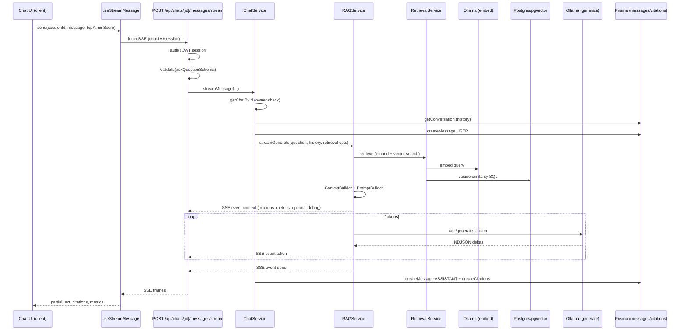

# MedBot — End-to-End Technical Audit & Architectural Review

**Audit date:** 2026-07-29  
**Repository:** `medbot` (private Next.js monolith)  
**Scope:** Full workspace scan — application code, Prisma schema/migrations, benchmarks, load tests, and documentation under `docs/`.

---

### 1. Executive Summary & Tech Stack Inventory

#### High-level overview

MedBot is a **retrieval-augmented generation (RAG)** web application that answers medical-style questions using a **grounded knowledge base** (default: Gale Encyclopedia of Medicine PDF). Users authenticate, maintain **chat sessions**, ask questions in natural language, and receive **streaming assistant replies** with **page-level citations** tied to ingested PDF chunks. Answers are generated by a **local Ollama** chat model constrained by retrieved context and a hardened system prompt (medical grounding, refusal when context is missing, prompt-injection defenses).

The system splits into:

- **Online path:** Next.js App Router UI → REST/SSE API routes → service layer → Prisma/PostgreSQL + pgvector → Ollama (embed + generate).
- **Offline path:** CLI ingestion (`npm run ingest`) — PDF extract → normalize → chunk → embed → persist `Document` + `Chunk` rows with `vector(768)` embeddings.

The product explicitly positions itself as **educational/research**, not a medical device (`README.md`, UI disclaimers, `PromptBuilder` rules).

#### Tech stack inventory

| Category | Technology | Version (package.json) | Role in this repo |
| --- | --- | --- | --- |
| Runtime | Node.js | 20+ (documented prerequisite) | Server, scripts, Vitest, ingestion |
| Language | TypeScript | ^5 | Strict typing across app and services |
| Framework | Next.js | 16.2.9 | App Router, API routes, RSC layouts, Turbopack dev |
| UI library | React / React DOM | 19.2.4 | Client components, streaming chat UX |
| React compiler | babel-plugin-react-compiler | 1.0.0 (`reactCompiler: true` in `next.config.ts`) | Automatic memoization / compiler optimizations |
| Styling | Tailwind CSS | ^4 (`@tailwindcss/postcss`) | Dark-first design tokens, utility layout |
| UI primitives | shadcn / Radix (`radix-ui`) | shadcn ^4.11.0, radix-ui ^1.6.0 | Accessible dialogs, sheets, hover cards, etc. |
| Icons | lucide-react | ^1.21.0 | Marketing and chat iconography |
| Forms | react-hook-form + @hookform/resolvers | ^7.80.0 / ^5.4.0 | Auth forms |
| Validation | Zod | ^4.4.3 | Env, API bodies, auth schemas |
| Auth | next-auth (Auth.js v5 beta) | ^5.0.0-beta.31 | Credentials provider, JWT sessions |
| Auth adapter | @auth/prisma-adapter | ^2.11.2 | Prisma tables for OAuth-style adapter (credentials-only today) |
| Password hashing | bcrypt | ^6.0.0 | User `passwordHash` at registration/seed |
| ORM | Prisma + @prisma/client | ^7.8.0 | Domain models; client emitted to `src/generated/` |
| DB driver | @prisma/adapter-pg + pg | ^7.8.0 / ^8.22.0 | Serverless-friendly Postgres via adapter |
| Database | PostgreSQL + pgvector | Extension in `prisma/migrations/.../init/migration.sql` | Relational data + `Chunk.embedding vector(768)` |
| Hosting DB (typical) | Neon | `.neon` project metadata | Serverless Postgres (documented in README/skills) |
| LLM / embeddings | ollama (npm client) + HTTP | ^0.6.3 | `nomic-embed-text` (768-d), `qwen2.5-coder:3b` chat |
| Client data fetching | @tanstack/react-query | ^5.101.0 | `QueryProvider` for client mutations/queries |
| Logging | pino + pino-pretty | ^10.3.1 / ^13.1.3 | Structured logs in services (`BaseService`) |
| Markdown | react-markdown, remark-gfm, rehype-highlight | ^10.1.0 / ^4.0.1 / ^7.0.2 | Assistant message rendering |
| Syntax highlight | highlight.js | ^11.11.1 | Code blocks in markdown |
| PDF (ingest) | pdf-parse | ^2.4.5 | Offline text extraction |
| PDF (viewer) | react-pdf | ^10.4.1 | Citation source viewer (lazy-loaded) |
| Toasts | sonner | ^2.0.7 | Chat rename/delete feedback |
| Dates | date-fns | ^4.4.0 | Sidebar chat grouping |
| IDs | uuid | ^14.0.1 | Request ID helper (unused in routes today) |
| Testing | vitest | ^4.1.9 (listed under **dependencies**) | Unit/integration tests for knowledge module |
| Load testing | autocannon, k6 scripts | autocannon ^8.0.0; k6 in `load/k6/` | Health/chat/stream load (`benchmarks/`, `load/`) |
| Script runner | tsx, dotenv | dev: tsx ^4.22.4, dotenv ^17.4.2 | Ingest, eval, benchmark CLIs |
| Lint | eslint + eslint-config-next | ^9 / 16.2.9 | `npm run lint` |

**Not present in application code:** Redis, message queues, CDN asset pipeline beyond Next defaults, i18n framework, application-level rate limiting, Next.js `middleware.ts` (no edge auth gate).

---

### 2. Architectural & Design Patterns

#### Core architectural pattern

**Modular monolith** on a **single Next.js 16 deployment**:

- **Presentation:** Route groups `(marketing)`, `(auth)`, `(app)` under `src/app/`.
- **API boundary:** Route handlers in `src/app/api/**` — thin controllers.
- **Application services:** `src/modules/*/services/` and top-level `src/services/base.service.ts`.
- **Persistence:** `src/repositories/` (+ one module-local `ChunkRepository`).
- **RAG/knowledge subdomain:** Rich pipeline under `src/modules/knowledge/` (ingestion, retrieval, builders, strategies, providers).

This aligns with **layered architecture** (UI → API → Service → Repository → DB) with a **vertical slice** for `knowledge` (RAG) and `chat` (conversation UX).

There is **no** microservice decomposition; Ollama is an **external process** dependency, not a separate deployable service in-repo.

#### Design patterns (with file references)

| Pattern | Usage | Representative locations |
| --- | --- | --- |
| **Repository** | Encapsulates Prisma access | `src/repositories/base.repository.ts`, `chat.repository.ts`, `user.repository.ts`, `document.repository.ts`, `src/modules/knowledge/repositories/chunk.repository.ts` |
| **Service layer** | Business orchestration, logging | `ChatService` (`src/modules/chat/services/chat.service.ts`), `AuthService`, `RAGService`, `IngestionService`, `RetrievalService` |
| **Strategy** | Pluggable chunking algorithm | `ChunkingStrategy` (`strategies/chunking.strategy.ts`), `RecursiveChunkingStrategy` (`recursive.strategy.ts`), injected into `ChunkingService` |
| **Builder** | Construct complex prompt/context artifacts | `ContextBuilder`, `PromptBuilder` (`builders/context.builder.ts`, `prompt.builder.ts`) |
| **Provider / Adapter** | Abstract vector store and embeddings | `VectorProvider` + `PostgresVectorProvider`; `EmbeddingProvider` + `OllamaEmbeddingProvider` |
| **Facade** | `VectorService` delegates to provider | `src/modules/knowledge/services/vector.service.ts` |
| **Template method / pipeline** | Ingestion stages | `IngestionService.ingest()` — checksum → dedupe → PDF → chunk → embed → upsert |
| **DTO + validation** | API input contracts | Zod schemas e.g. `ask-question.schema.ts`, `auth.schema.ts`; `validate()` in `src/lib/validate.ts` |
| **Standard API envelope** | `{ success, data }` / `{ success, false, error }` | `requestHandler` (`src/lib/request-handler.ts`), `handleError` (`src/lib/error-handler.ts`) |
| **Custom error taxonomy** | Typed HTTP mapping | `AppError` hierarchy (`src/lib/errors/*`, `ErrorCode` in `src/types/error.types.ts`) |
| **Async generator / streaming** | SSE + Ollama NDJSON | `RAGService.streamGenerate`, `OllamaChatService.generateStream`, stream route |
| **Singleton (process)** | Prisma client reuse | `src/lib/prisma.ts` (`globalThis` in non-production) |
| **Dependency injection (light)** | Constructor defaults for testability | `RAGService`, `RetrievalService`, `VectorService` accept optional deps in constructors |
| **Observer-like (UI)** | Cross-tab settings sync | `CustomEvent` + `storage` in `use-retrieval-settings.tsx`, `use-dev-mode.ts`, `use-theme.tsx` |
| **Lazy loading** | Code splitting | `source-viewer-lazy.tsx` (`next/dynamic`, `ssr: false`) |

**Anti-pattern / drift:** Duplicate **`ChatRepository`** implementations — canonical `src/repositories/chat.repository.ts` (used by `ChatService`) vs stale copy `src/modules/chat/repositories/chat.repository.ts` (documented in `docs/frontend-roadmap.md`, not imported).

**Dead code:** `MessageService`, `UserService` — defined but not referenced by routes or `ChatService`. `createRequestId` in `src/middlewares/request-id.ts` — never wired.

#### Separation of concerns & modularity

**Strengths**

- Route handlers generally delegate to services; RAG logic is centralized in `RAGService` rather than duplicated in routes.
- Knowledge pipeline is cohesive: constants, types, strategies, providers, and scripts live under `modules/knowledge`.
- Clear boundary between **streaming protocol** (route SSE framing) and **domain events** (`RAGStreamEvent`).
- Frontend modules mirror domains: `chat`, `auth`, `dashboard`, `marketing`, `settings`.

**Weaknesses**

- **Auth concerns split inconsistently:** Some APIs use `auth()` + 401 JSON (`stream`, `documents`, `chunks`); others use `requireUser()` which **`redirect("/login")`** — inappropriate for non-browser API clients (`src/app/api/chats/route.ts`, `messages/route.ts`, etc.).
- **Environment configuration split:** `src/config/env.ts` validates core vars; `OllamaChatService` reads `process.env.OLLAMA_BASE_URL` directly without Zod.
- **Console logging in hot paths:** `PostgresVectorProvider.search` logs on every query — noisy and costly under load.
- **Typo / naming debt:** `chunking.serivce.ts` filename; `MessageService` logs `role: "USER"` for assistant messages.
- **JWT + Prisma adapter:** `auth.ts` sets `session.strategy: "jwt"` while still registering `PrismaAdapter` — adapter adds schema surface without being used for session persistence.

**Modularity score (qualitative):** **B+** for backend RAG and chat services; **B** overall due to duplicate repositories, unused services, and inconsistent API auth helpers.

---

### 3. System Flows & Lifecycle Mapping

#### Primary user journey: ask a question (streaming)

**State changes**

1. **Client:** `useStreamMessage` sets `streaming`, accumulates `partial`, `citations`, `metrics`, optional `debug` (dev mode header).
2. **Server DB:** Inserts `Message` (USER) before generation; inserts `Message` (ASSISTANT) + `Citation` rows after stream completes (including partial on abort if text accumulated).
3. **No server-side chat list cache invalidation contract** — sidebar chat list is loaded in RSC `chat-layout.tsx` on navigation; client mutations may rely on local optimistic updates (rename/delete) or full layout refresh.

**API boundaries**

| Layer | Responsibility |
| --- | --- |
| `src/modules/chat/api/stream.ts` | Browser SSE parser → `StreamEvent` |
| `src/app/api/chats/[id]/messages/stream/route.ts` | Auth, validation, SSE framing, heartbeat, abort propagation |
| `ChatService` | Ownership, persistence, RAG delegation |
| `RAGService` | Retrieval → context → prompt → Ollama stream |

**Retrieval parameters:** Server defaults `DEFAULT_TOP_K = 5`, `DEFAULT_CANDIDATE_POOL_SIZE = 20`, `DEFAULT_MIN_SIMILARITY_SCORE = 0.70` (`retrieval.constants.ts`). Client may override via Settings (`useRetrievalSettings` → localStorage) passed per request.

#### Secondary flows

| Flow | Path |
| --- | --- |
| Register | `POST /api/auth/register` → `validate(registerSchema)` → `AuthService.register` → `UserRepository` |
| Login (UI) | NextAuth `Credentials` → `AuthService.login` in `authorize` (`src/auth.ts`) |
| Login (API helper) | `POST /api/auth/login` → returns `{ id }` only (does not set session by itself) |
| Create chat | `POST /api/chats` → `ChatService.createChat` (title from body, **no Zod schema**) |
| List chats | `GET /api/chats` → `getUserChats` |
| Rename/delete | `PATCH` / `DELETE /api/chats/[id]` |
| Citation preview | `GET /api/chunks/[id]` → chunk excerpt |
| PDF viewer | `GET /api/documents/[id]` → streams file from `knowledge-base/` with path traversal checks |
| Health | `GET /api/health` → `SELECT 1` via Prisma |
| Offline ingest | `npm run ingest` → `IngestionService` → `VectorService.upsert` |

#### Authentication flow

1. User submits credentials on `/login`.
2. NextAuth `Credentials` provider calls `AuthService.login` (bcrypt compare).
3. On success, **JWT session** is issued (`session.strategy: "jwt"`), `maxAge: 24*24*60` seconds (~9.6 hours — likely unintended; common intent is `24*60*60` for one day).
4. JWT callback copies `id`, `email`, `name` into session (`src/auth.ts`).
5. **Page protection:** `requireUser()` in `(app)` layouts/pages and `chat-layout.tsx` redirects unauthenticated users to `/login`.
6. **API protection:** Mixed — streaming and document/chunk routes return **401 JSON**; chat CRUD/message routes use **`requireUser()` redirect** (problematic for programmatic clients).

**Authorization model**

- **Chat sessions:** `userId` on `ChatSession`; `findByIdAndUserId` enforces ownership on read/update/delete/message.
- **Knowledge corpus:** Global — any authenticated user can retrieve any chunk/document (noted in `documents/[id]/route.ts` comments).
- **No RBAC:** Single role (authenticated user). Seed creates one admin-style user.

#### Data validation flow

| Entry point | Validation |
| --- | --- |
| Env boot | `envSchema.parse` in `src/config/env.ts` (throws at import if invalid) |
| Register | `registerSchema` |
| Login API | `loginSchema` |
| Ask / stream message | `askQuestionSchema` (message 1–5000 chars, optional topK 1–20, minScore 0–1) |
| Rename chat | Ad-hoc `typeof body.title === "string"` only |
| Create chat | No schema on `body.title` |

Validation errors become `ValidationError` → `handleError` → HTTP 400 with `VALIDATION_ERROR`.

#### Middleware

- **No Next.js `middleware.ts`** for global auth, security headers, or rate limits.
- `request-id` helper exists but is **not integrated** into route handlers or logging context.

---

### 4. Reverse-Engineered PRD (Product Requirement Document)

#### User personas & roles

| Persona | Needs inferred from code/docs |
| --- | --- |
| **Authenticated end user** | Register/login, manage chats, ask medical questions, view citations and PDF sources, adjust UI preferences. |
| **Medical student / researcher** | Cited, scannable answers; markdown tables/code; safety disclaimer; refusal when KB lacks context. |
| **Developer / demo operator** | Dev mode, retrieval inspector (`x-medbot-debug: 1`), RAG metrics on messages, performance harness. |
| **Recruiter / evaluator** | Polished marketing page, dark-first UI, `data-testid` hooks (per `docs/memory.md`). |
| **Operator (implicit)** | Runs Ollama locally, ingests PDF, seeds DB — no in-app admin UI for ingestion. |

**Roles:** Only **authenticated user**; no admin/moderator split in schema or routes.

#### Core feature set (by module)

| Module | Features |
| --- | --- |
| **Marketing** (`(marketing)/`, `modules/marketing`) | Landing: hero, feature strip, how-it-works, footer, mobile nav. |
| **Auth** (`(auth)/`, `modules/auth`) | Register, login cards, bcrypt registration, NextAuth session. |
| **Dashboard** | Recent chats, quick actions, empty states. |
| **Chat** | New chat, threaded messages, streaming SSE, stop/regenerate, export, command palette (⌘K), suggested questions, sidebar search/grouping, rename/delete, mobile sidebar. |
| **Citations & sources** | Inline citation numbers, hover preview (`/api/chunks/[id]`), PDF viewer with page jump/zoom, citation list dedupe. |
| **RAG observability** | Per-message metrics card, retrieval inspector (dev mode), confidence heuristics from retrieval scores. |
| **Settings** | Theme (light/dark), font size, retrieval sliders (localStorage), model display, dev mode toggle. |
| **Knowledge (offline)** | PDF ingest, chunking, embedding, pgvector storage, checksum idempotency, retrieval evaluation script. |
| **API** | REST + SSE as documented in README. |

#### Business logic rules

**Retrieval & context**

- Embed user query via Ollama `nomic-embed-text` (768 dimensions).
- Vector search: cosine similarity (`<=>` operator), optional filters (documentId, chapter, section).
- Pool size default 20; slice to `topK` (default 5) after min-score filter (default 0.70).
- `ContextBuilder` packs chunks until `MAX_CONTEXT_CHARACTERS` (6000 tokens × 4 chars heuristic).
- Citations only for chunks that survive context budget; `RAGService.filterCitations` aligns citations with accepted chunks.
- Chunks without `pageNumber` fail citation building in `RetrievalService.buildCitations` (hard error).

**Generation**

- Model hardcoded to `qwen2.5-coder:3b` in `RAGService` (not user-selectable server-side despite UI model chip).
- System prompt enforces: grounding-only medical facts, explicit refusal on `[NO_RELEVANT_MEDICAL_CONTEXT]`, injection resistance, no fabricated citations (`prompt.builder.ts`).
- Conversation history capped by `MAX_HISTORY_MESSAGES` and `MAX_HISTORY_CHARACTERS` (`prompt.constants.ts`).

**Chat**

- Title rename: trim, max 200 chars, non-empty (`ChatService.renameChat`).
- User message max 5000 chars (Zod).
- Streaming persists assistant output even on client abort if partial text exists.

**Auth**

- Password min 8 chars register/login schemas.
- Duplicate email → `EmailAlreadyExistsError`.
- Invalid login → generic `ValidationError("Invalid Credentials")` (no user enumeration on login path).

**Ingestion**

- SHA-256 checksum deduplication — skip re-ingest if document exists.
- Batch vector upsert with retries (50 chunks/batch, exponential backoff).

**Documents**

- PDF served only from `knowledge-base/` with basename sanitization and prefix guard.

#### Non-functional requirements (as implemented)

| NFR | Implementation |
| --- | --- |
| **Security** | bcrypt passwords; JWT sessions; AUTH_SECRET required; PDF path traversal checks; prompt-injection rules in system prompt; HTTPS assumed via deployment. **Gaps:** no rate limiting, no CSRF-specific handling beyond NextAuth defaults, global KB access for all users, seed password in repo, debug header exposes prompt chunks to any authenticated dev-mode client. |
| **Caching** | PDF response `Cache-Control: private, max-age=3600`; citation hover module-level cache (client); no HTTP cache on chat APIs; `force-dynamic` on streaming routes. |
| **Rate limiting** | **Not implemented** in app code (only transitive dep in lockfile). |
| **Performance** | React Compiler; lazy PDF viewer; SSE heartbeats (15s); perf suite in `benchmarks/` and `docs/performance-test-report.md` (retrieval p95 ~255ms; chat API load marginal vs 500ms target; stream TTFB ~13s cold). |
| **Observability** | Pino logging in services; console logging in vector provider/ingestion; no OpenTelemetry. |
| **Reliability** | Ingestion batch retries; stream abort propagates to Ollama; health check hits DB. |
| **Localization** | `lang="en"` only; no i18n keys. |
| **Accessibility** | Radix primitives; keyboard shortcuts (chat, command palette); partial `data-testid` coverage per product docs. |
| **Testing** | Vitest focused on **knowledge module** (9 test files); **no** automated tests for auth, API routes, or React components. |

---

### 5. Architectural Critique & Refactoring Roadmap

#### Technical debt & code smells

| Issue | Severity | Detail |
| --- | --- | --- |
| API auth uses `redirect` | High | `requireUser()` in API routes breaks JSON clients and load tools (cf. k6 NextAuth issues in perf report). |
| No pgvector ANN index | High | Migrations create B-tree indexes only; similarity search will seq-scan as chunks grow. |
| Duplicate `ChatRepository` | Medium | Dead copy under `modules/chat/repositories/`. |
| Unused services | Low | `MessageService`, `UserService` bypassed by `ChatService` + `ChatRepository`. |
| Hot-path `console.log` | Medium | `PostgresVectorProvider.search` on every query. |
| Inconsistent env access | Low | Ollama URL not in validated `env` object. |
| Missing validation on chat create/rename | Medium | `POST /api/chats` unvalidated title; rename uses raw `Error` not `ValidationError`. |
| Session `maxAge` typo? | Medium | `24*24*60` in `auth.ts` — verify intent. |
| Hardcoded LLM model | Medium | Settings UI suggests model choice; server ignores it. |
| JWT + unused adapter tables | Low | Simplifies or document why adapter remains. |
| `vitest` in dependencies | Low | Should be devDependency for production install size. |
| Filename typo | Low | `chunking.serivce.ts`. |
| `MessageService` logging bug | Low | Assistant path logs USER role. |
| Request ID middleware unused | Low | Missed correlation IDs in logs. |
| Prisma `Unsupported("vector")` | Info | Requires raw SQL for embeddings (handled, but schema tooling limited). |

**Security notes (objective):** Default seed credentials documented in README; no account lockout; registration open if endpoint exposed; debug SSE leaks system prompt preview to clients sending `x-medbot-debug: 1`.

#### Scalability bottlenecks

1. **Ollama on single host** — chat and embed share one inference server; no queue, no horizontal scaling of generation.
2. **Synchronous RAG per request** — embed + DB search + LLM stream tied to one Node request lifecycle (mitigated by streaming, not by worker offload).
3. **pgvector without HNSW/IVFFlat index** — latency scales linearly with chunk count.
4. **Connection pool defaults** — Neon/serverless + long SSE connections may exhaust DB connections under concurrent streams.
5. **Full chat history load** — every message fetch for RAG history (bounded in prompt, not in DB query).
6. **Global knowledge base** — all users share one corpus; fine for demo, not multi-tenant isolation.
7. **No CDN/object storage for PDFs** — disk read per document view from app server filesystem.

#### Actionable roadmap

##### Critical

1. **Unify API authentication** — Replace `requireUser()` with `requireSession()` (or `auth()` + 401 JSON) in all `src/app/api/**` routes; keep `redirect` only in RSC pages/layouts.  
   *Files:* `src/lib/auth-utils.ts`, all API route handlers under `src/app/api/chats/`.

2. **Add pgvector index** — Migration: `CREATE INDEX ... ON "Chunk" USING hnsw (embedding vector_cosine_ops)` (or IVFFlat with analyze) after ingest baseline; document rebuild after major re-ingest.  
   *Files:* new `prisma/migrations/*`, optional note in README.

3. **Production hardening for secrets & seeds** — Disable default seed in production; env-guard `npm run seed`; document rotation for `AUTH_SECRET`.

##### High

4. **Remove duplicate `ChatRepository`** — Delete `src/modules/chat/repositories/chat.repository.ts` or merge; single import path via `@/repositories`.

5. **Rate limiting & abuse controls** — Add middleware or route wrapper for `/api/auth/register`, `/messages/stream`, and embed-heavy paths (e.g. `@upstash/ratelimit` or Vercel firewall rules per deployment target).

6. **Structured logging on retrieval** — Replace `console.log` in `PostgresVectorProvider.search` with `logger.debug` behind env flag; integrate `createRequestId` in `requestHandler` and stream route.

7. **Validate all write APIs with Zod** — `createChatSchema`, `renameChatSchema`; map to `ValidationError`.

8. **Align model configuration** — Centralize `OLLAMA_CHAT_MODEL` / `OLLAMA_EMBED_MODEL` in `env.ts`; wire Settings UI or remove misleading model picker.

##### Medium

9. **Consolidate message persistence** — Either use `MessageService` or delete it; keep `ChatRepository` as single write path for conversations.

10. **Session maxAge review** — Set explicit duration (e.g. 30 days) and document; remove unused Prisma adapter if staying JWT-only.

11. **Ollama resilience** — Timeouts, circuit breaker, and user-visible degradation when Ollama is down (health check could probe Ollama).

12. **Expand test pyramid** — API route tests (stream framing, auth 401), `ChatService` ownership tests, Playwright smoke for login → ask flow.

13. **Move vitest to devDependencies** — Clean production `npm install`.

##### Low

14. **Rename `chunking.serivce.ts`** → `chunking.service.ts` and fix imports.

15. **Fix `MessageService` log role** for assistant messages.

16. **Document architecture** — Keep `README.md` as source of truth; link this audit for onboarding.

17. **i18n / a11y audit** — If product expands beyond demo, add locale pipeline and axe checks in CI.

---

## Appendix: Repository layout (concise)

| Path | Purpose |
| --- | --- |
| `src/app/` | Routes, layouts, API handlers |
| `src/modules/` | Domain UI + services (auth, chat, knowledge, marketing, settings, dashboard, rag constants) |
| `src/repositories/` | Prisma repositories (primary persistence API) |
| `src/components/` | Shared UI, markdown |
| `src/hooks/`, `src/providers/` | Client state and React Query |
| `src/lib/` | Cross-cutting utilities (prisma, errors, validate, api) |
| `src/generated/` | Prisma client output |
| `prisma/` | Schema, migrations, seed |
| `benchmarks/`, `load/` | Performance and load testing |
| `docs/` | Phase notes, frontend PRD (`memory.md`), perf guides |

---

*This document was generated from static analysis of the repository as of the audit date. Runtime behavior (Ollama models, Neon limits, deployment topology) may vary by environment.*
