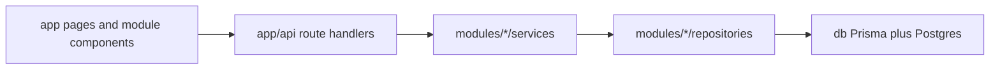

# MedBot code map

How to **read** this repo. Architecture and folders stay as they are today — this doc only explains where things live and how requests move through files.

## Mental model

Thin Next.js routes call feature modules. Business logic lives in services; data access lives in repositories; Prisma sits behind `src/db`.



Rule of thumb:

| Layer | Job | Usually contains |
| --- | --- | --- |
| `src/app/**` | Routing only | `page.tsx`, `layout.tsx`, thin `route.ts` |
| `src/modules/**` | Feature ownership | components, services, repos, schemas |
| `src/components/**` | Shared UI | shadcn, markdown, navbar |
| `src/lib/**`, `src/db/**` | Cross-cutting | auth config, helpers, Prisma client |

---

## Root layout

| Path | Purpose |
| --- | --- |
| [`README.md`](../../README.md) | Product overview, setup, scripts, API summary |
| [`docs/`](../README.md) | All documentation (this file lives under `docs/architecture/`) |
| [`tests/`](../../tests/) | Unit, integration, e2e, fixtures |
| [`benchmarks/`](../../benchmarks/) | CPU benches, load scripts, k6, results |
| [`scripts/`](../../scripts/) | CLIs (`ingest`, evaluate retrieval) and `scripts/dev/` debug tools |
| [`prisma/`](../../prisma/) | Schema, migrations, seed |
| [`knowledge-base/`](../../knowledge-base/) | PDFs to ingest (often gitignored) |
| [`public/`](../../public/) | Static assets |
| [`src/`](../../src/) | Application source (Next.js + modules) |

---

## `src/` folder map

| Path | Role |
| --- | --- |
| [`app/(marketing)`](../../src/app/(marketing)/) | Landing page routes |
| [`app/(clerk)`](../../src/app/(clerk)/) | Clerk sign-in / sign-up |
| [`app/(main)`](../../src/app/(main)/) | Dashboard, chat, settings (authenticated product UI) |
| [`app/api`](../../src/app/api/) | HTTP API entrypoints (thin handlers) |
| [`app/providers.tsx`](../../src/app/providers.tsx) | React Query provider |
| [`modules/`](../../src/modules/) | **Feature modules** — primary place to change product behavior |
| [`components/`](../../src/components/) | Shared UI (`ui/`, markdown, marketing atoms, navbar) |
| [`lib/`](../../src/lib/) | Helpers, envelopes, validation, **`lib/auth-utils.ts`** (Clerk) |
| [`db/`](../../src/db/) | Prisma singleton (`@/db`) |
| [`core/`](../../src/core/) | `BaseRepository` / `BaseService` |
| [`config/`](../../src/config/) | Env (`env.ts`) and site metadata |
| [`types/`](../../src/types/) | Shared TS types (auth roles, API) |
| [`hooks/`](../../src/hooks/) | Shared React hooks (theme, font size, chat shortcuts, …) |
| [`constants/`](../../src/constants/) | Shared constants |
| [`middlewares/`](../../src/middlewares/) | Request helpers (e.g. request id) — not Next middleware |
| [`proxy.ts`](../../src/proxy.ts) | Next.js 16 auth gate for protected routes/APIs |
| [`styles/`](../../src/styles/) | Global / shared styles if present |
| [`generated/`](../../src/generated/) | Prisma generated client (do not hand-edit) |

Inside each feature module, expect some of:

```text
modules/<feature>/
  components/     # UI owned by this feature
  services/       # Business logic
  repositories/   # DB access
  schemas/        # Zod inputs
  api/            # Client fetch helpers (when present)
  hooks/ types/ constants/ …
```

---

## Module cheat sheet

| Module | Owns |
| --- | --- |
| [`auth`](../../src/modules/auth/) | RBAC permission map only (Clerk owns sign-in) |
| [`chat`](../../src/modules/chat/) | Chat shell, messages, streaming client, chat/message services & repos |
| [`knowledge`](../../src/modules/knowledge/) | Ingestion, chunking, embeddings, retrieval, RAG orchestration |
| [`rag`](../../src/modules/rag/) | Prompt constants / RAG prompt text |
| [`user`](../../src/modules/user/) | User repository & service |
| [`dashboard`](../../src/modules/dashboard/) | Dashboard UI pieces |
| [`settings`](../../src/modules/settings/) | Settings panels (theme, retrieval prefs, account/MFA UI hooks) |
| [`marketing`](../../src/modules/marketing/) | Landing header/hero/footer components |

---

## Flow 1 — Login

```text
Browser  →  /sign-in
         →  src/app/(clerk)/sign-in/[[...sign-in]]/page.tsx
         →  Clerk <SignIn />
         →  requireUser / requireApiUser
         →  ClerkUserService upserts Prisma User by clerkId
```

Related:

- Full auth architecture: [`auth.md`](./auth.md)
- Gate for protected pages: [`src/proxy.ts`](../../src/proxy.ts)
- Session helpers: [`src/lib/auth-utils.ts`](../../src/lib/auth-utils.ts), [`src/lib/current-user.ts`](../../src/lib/current-user.ts)
- Clerk webhook: [`src/app/api/webhooks/clerk/route.ts`](../../src/app/api/webhooks/clerk/route.ts)

---

## Flow 2 — Ask a question (SSE stream)

```text
Browser  →  /chat/[id]
         →  src/app/(main)/chat/... + modules/chat/components/*
         →  POST /api/chats/[id]/messages/stream
         →  src/app/api/chats/[id]/messages/stream/route.ts
              ├ requireApiUser (@/lib/auth-utils)
              ├ validate askQuestionSchema
              └ ChatService (@/modules/chat/services)
                   └ RAG / knowledge retrieval + Ollama generation
                   └ message/chat repositories → @/db → Postgres/pgvector
         ←  SSE frames: context → token* → done|error
```

Key files:

- Route: [`src/app/api/chats/[id]/messages/stream/route.ts`](../../src/app/api/chats/[id]/messages/stream/route.ts)
- Chat domain: [`src/modules/chat/services/`](../../src/modules/chat/services/)
- RAG / retrieval: [`src/modules/knowledge/services/`](../../src/modules/knowledge/services/)
- Client stream helper: [`src/modules/chat/api/stream.ts`](../../src/modules/chat/api/stream.ts)

---

## Flow 3 — Ingest a PDF

```text
CLI  →  npm run ingest  (or tsx scripts/ingest-pdf.ts)
     →  scripts/ingest-pdf.ts
     →  knowledge-base/<file>.pdf
     →  IngestionService  (modules/knowledge/services/ingestion.service.ts)
          ├ chunking / embedding providers
          └ repositories → @/db → Document + Chunk (+ vectors)
```

Key files:

- Script: [`scripts/ingest-pdf.ts`](../../scripts/ingest-pdf.ts)
- Knowledge services: [`src/modules/knowledge/services/`](../../src/modules/knowledge/services/)
- Schema: [`prisma/schema.prisma`](../../prisma/schema.prisma)

---

## Where do I change X?

| Want to change… | Look here |
| --- | --- |
| Login / register UI | `src/app/(clerk)/`, Clerk Dashboard |
| Auth session helpers | `src/lib/auth-utils.ts`, `src/modules/user/services/clerk-user.service.ts` |
| Which routes require login | `src/proxy.ts` |
| Chat layout, citations, sidebar | `src/modules/chat/components/` |
| Ask/stream API contract | `src/app/api/chats/`, `modules/chat/schemas/` |
| Retrieval scoring / RAG pipeline | `src/modules/knowledge/` |
| System / RAG prompts | `src/modules/rag/prompts/` |
| Env vars | `src/config/env.ts`, `.env.example` |
| Shared buttons/inputs | `src/components/ui/` |
| Prisma models | `prisma/schema.prisma` |
| Unit / integration tests | `tests/unit/`, `tests/integration/` |
| Perf / load | `benchmarks/` |

---

## Reading order (first hour)

1. This file (CODEMAP)
2. [`README.md`](../../README.md) — setup + API overview
3. Pick one flow above and open only those paths
4. Deeper product detail: [`docs/product/PRODUCT_PRD.md`](../product/PRODUCT_PRD.md) when needed
