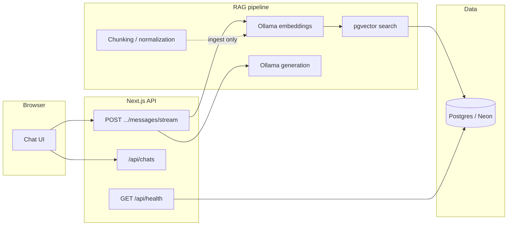
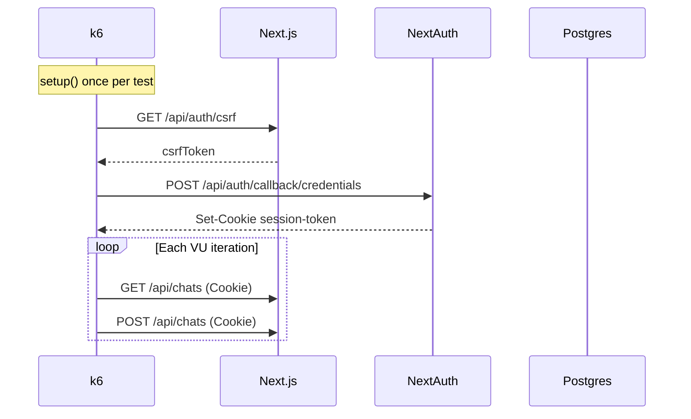

# Medbot performance, benchmark, and load testing — full guide

**Executed results (numbers from a real run):** [performance-test-report.md](./performance-test-report.md)

This document explains **why** we measure performance, **what** each tool does, **how** to run everything, and **how to read the output**. It matches the harness under `benchmarks/` and `load/k6/`.

For a short command cheat sheet, see [performance.md](./performance.md).

---

## 1. Why three different kinds of tests?

Performance work is not one activity. We split it into three layers because each answers a different question:

| Kind | Question it answers | Needs network? | Needs Ollama/DB? | Typical speed |
|------|---------------------|----------------|------------------|---------------|
| **Micro-benchmarks** | Is our pure TypeScript (chunking, normalization) fast enough per call? | No | No | Seconds |
| **Integration benchmarks** | How long does embedding or full retrieval take end-to-end? | Yes (Ollama, Neon) | Yes | Tens of seconds |
| **Load tests** | When many clients hit the API at once, do we stay fast and reliable? | Yes (running app) | DB for health; auth user for chat/stream | 10s–minutes |

**Unit tests** (`npm run test`) check *correctness*. **Benchmarks** check *speed of specific code paths*. **Load tests** check *behavior under concurrency* (latency distribution, errors, throughput).

They complement each other:

- Chunking can be microseconds-fast while `/api/health` is slow because Postgres is cold.
- Retrieval can be fine at 1 QPS but Ollama can melt at 50 parallel stream requests.

---

## 2. What parts of Medbot we care about

Medbot is a Next.js app with a RAG pipeline:



| Area | Code / route | What we measure |
|------|----------------|-----------------|
| Ingestion CPU | `ChunkingService`, `NormalizationService`, recursive strategy | Ops/sec in Vitest bench |
| Query embedding | `OllamaEmbeddingProvider` | ms per query (p50/p95) |
| Retrieval | `RetrievalService` (embed + vector search) | ms per query |
| Liveness | `GET /api/health` | Latency under many connections |
| App API | `GET/POST /api/chats` | Latency under VUs with session cookie |
| Chat stream | `POST /api/chats/:id/messages/stream` | Time to first byte (TTFB), full SSE body |

We do **not** yet automate Lighthouse / Core Web Vitals in this harness (possible follow-up).

---

## 3. Repository layout

```
medbot/
├── benchmarks/
│   ├── chunking.bench.ts      # Vitest bench — CPU-only
│   ├── lib/stats.ts             # p50/p95 helpers for TS scripts
│   ├── run-embedding.ts         # Times Ollama embed calls
│   ├── run-retrieval.ts         # Times embed + pgvector retrieval
│   └── run-health-load.ts       # autocannon load on /api/health
├── load/k6/
│   ├── health.js                # k6: public health endpoint
│   ├── chat.js                  # k6: list + create chats (authenticated)
│   ├── stream.js                # k6: one SSE message per iteration (low VUs)
│   └── lib/auth.js              # NextAuth credentials login for k6
├── docs/
│   ├── performance.md           # Short reference
│   └── performance-testing-guide.md  # This file
└── vitest.config.ts             # Includes benchmarks/**/*.bench.ts
```

**npm scripts** (from `package.json`):

| Script | What runs |
|--------|-----------|
| `npm run bench` | `vitest bench` → `benchmarks/chunking.bench.ts` |
| `npm run bench:embedding` | `benchmarks/run-embedding.ts` |
| `npm run bench:retrieval` | `benchmarks/run-retrieval.ts` |
| `npm run load:health` | `benchmarks/run-health-load.ts` (autocannon) |
| `npm run load:chat` | `benchmarks/run-chat-load.ts` (authenticated fetch) |
| `npm run perf:smoke` | `benchmarks/run-stream-smoke.ts` (E2E SSE) |
| `npm run perf:all` | `benchmarks/run-all.ts` |
| `npm run load:k6:health` | `k6 run load/k6/health.js` |
| `npm run load:k6:chat` | `k6 run load/k6/chat.js` |
| `npm run load:k6:stream` | `k6 run load/k6/stream.js` |

---

## 4. Layer 1 — Micro-benchmarks (`npm run bench`)

### What happens

1. Vitest loads `benchmarks/chunking.bench.ts`.
2. For each `bench("name", () => { ... })` block, Vitest runs the function many times (warmup + samples).
3. It prints a table: **hz** (operations per second), **mean/min/max**, and percentiles (**p75, p99**, etc.).

### What is being timed

| Benchmark name | Code under test | Fixture |
|----------------|-----------------|---------|
| `chunking: LARGE_PARAGRAPH` | `ChunkingService.createChunks()` | ~7.2k chars (`"Heart disease ".repeat(600)`) |
| `chunking: OVERLAP_TEXT` | Same | Long repeated sentence |
| `chunking: MEDICAL_TEXT` | Same | Short multi-line clinical-style text |
| `recursive strategy: LARGE_PARAGRAPH` | `RecursiveChunkingStrategy.chunk()` | Large paragraph |
| `normalization: LARGE_PARAGRAPH` | `NormalizationService.normalize()` | Large paragraph |

Fixtures live in `src/modules/knowledge/__tests__/fixtures.ts` (shared with unit tests).

### How to read the output

Example line:

```
· chunking: LARGE_PARAGRAPH    5,592.43  0.1414  2.1984  0.1788  ...
```

- **hz ~5592** → about 5,592 chunking runs per second on your machine.
- **mean ~0.18 ms** → average time per `createChunks` call.
- **p99** → 99% of runs were faster than this; catches occasional GC spikes.

Vitest ends with a **BENCH Summary** ranking which case was fastest (e.g. small `MEDICAL_TEXT` vs large paragraph).

### When to use

- After changing chunking constants, strategies, or normalization.
- In CI: fast, no `.env`, no Docker, no Ollama.

### Notes

- Vitest marks `bench` as **experimental**; pin Vitest version if you rely on it in CI.
- Results vary by CPU load; compare before/after on the same machine, not across laptops.

---

## 5. Layer 2a — Embedding benchmark (`npm run bench:embedding`)

### What happens

1. Loads `.env` via `dotenv` (same as other server scripts).
2. Creates `OllamaEmbeddingProvider` (default host `http://localhost:11434`, model from `EMBEDDING.MODEL` in code).
3. **Warmup**: one embed call so the model is loaded in Ollama.
4. For each of **5 fixed medical-style queries**, runs `BENCH_ITERATIONS` embeds (default **10**).
5. Prints a table per query and an aggregate table using `benchmarks/lib/stats.ts` (min, mean, **p50, p95, p99**).

### What is *not* included

- Postgres, vector search, or LLM text generation — only the embedding HTTP call to Ollama.

### Prerequisites

- Ollama running locally (or `OLLAMA_BASE_URL` in `.env` if you wire it through app config; the provider uses `EMBEDDING.OLLAMA_BASE_URL` in `embedding.constants.ts` unless you change code).
- Embedding model pulled (e.g. `nomic-embed-text`).

### If it fails

Script sets `process.exitCode = 1` and prints that Ollama is unreachable. Fix Ollama first, then re-run.

### Env

| Variable | Default | Meaning |
|----------|---------|---------|
| `BENCH_ITERATIONS` | `10` | Repeats per query |

---

## 6. Layer 2b — Retrieval benchmark (`npm run bench:retrieval`)

### What happens

1. Requires `DATABASE_URL` in `.env`.
2. Instantiates `RetrievalService` (real `OllamaEmbeddingProvider` + real `VectorService` / Postgres).
3. Warmup retrieval with query `"warmup query"`.
4. For **3 queries**, runs `BENCH_ITERATIONS` (default **5**) full retrievals.
5. Each retrieval:
   - Embeds the query via Ollama.
   - Runs pgvector similarity search with `topK=5`, `candidatePoolSize=20` (app defaults from `retrieval.constants.ts`).
   - Filters by minimum similarity inside the service.

### Prerequisites

- Ollama + `DATABASE_URL` (Neon or local Postgres).
- **Ingested documents** — otherwise search returns empty results but timing is still valid.

### How to interpret

- **High p95** often means cold Ollama, slow network to Neon, or large index — not necessarily bad application code.
- Compare runs after index migrations, pool size changes, or embedding model swaps.

---

## 7. Layer 3 — Load testing

Load tests simulate **many clients** or **sustained traffic**. We use two tools:

| Tool | Used by | Install |
|------|---------|---------|
| **autocannon** | `npm run load:health` | npm devDependency (already in project) |
| **k6** | `npm run load:k6:*` | Separate binary — [k6 install docs](https://grafana.com/docs/k6/latest/set-up/install-k6/) |

### 7.1 Health load — autocannon (`npm run load:health`)

**Purpose:** Stress `GET /api/health` only. No login.

**What happens:**

1. autocannon opens `LOAD_CONNECTIONS` (default **20**) concurrent HTTP connections.
2. For `LOAD_DURATION_SEC` (default **10** seconds), keeps requesting `/api/health`.
3. Prints total requests, throughput (req/s), latency mean/p50/p95/p99, errors.
4. Compares p95 to `SLO_HEALTH_P95_MS` (default **200** ms). If worse, exits with code **1** (useful for scripts/CI).

**What `/api/health` does:** Runs `SELECT 1` on Prisma/Postgres and returns JSON `{ status, database }`. So this load test includes **DB round-trip**, not just a static JSON handler.

**Before running:**

```bash
npm run build && npm run start
# or: npm run dev
```

Set `BASE_URL` if not on port 3000.

### 7.2 Health load — k6 (`npm run load:k6:health`)

Same endpoint, but k6 **virtual users** (`LOAD_VUS`, default **10**) for `LOAD_DURATION` (default **30s**).

**Thresholds** (built into the script):

- `http_req_failed` &lt; 1%
- `http_req_duration` p95 &lt; `SLO_HEALTH_P95_MS` (200 ms)

k6 is better for **scenario growth** (ramp-up, stages, Grafana Cloud). autocannon is better for a **quick local smoke** without installing k6.

### 7.3 Chat API load — fetch (`npm run load:chat`)

**Purpose:** Authenticated pressure on `GET /api/chats` and `POST /api/chats`.

Uses the same NextAuth credentials flow as `perf:smoke` (Node `fetch`), which is **more reliable** than k6 against Auth.js in this repo.

See [performance-test-report.md](./performance-test-report.md) for sample numbers.

### 7.4 Chat API load — k6 (`npm run load:k6:chat`)

**Purpose:** Authenticated CRUD-ish pressure on chat list + create.

**Flow:**



**Defaults:** `LOAD_TEST_EMAIL=admin@medbot.com`, `LOAD_TEST_PASSWORD=password123` (user from `npm run seed`).

**Thresholds:** p95 &lt; `SLO_API_P95_MS` (500 ms), failed requests &lt; 5%.

### 7.5 Stream load — k6 (`npm run load:k6:stream`)

**Purpose:** Smoke-test the **SSE** RAG endpoint under light concurrency.

**Why low VUs (default 2)?** Each iteration calls Ollama for embed + generate. High concurrency would queue on GPU/CPU and measure Ollama saturation, not Next.js.

**Flow:**

1. `setup()`: login + `POST /api/chats` → save `chatId`.
2. Each iteration: `POST /api/chats/{chatId}/messages/stream` with body:
   ```json
   { "sessionId": "<same as chatId>", "message": "What are common symptoms of diabetes?" }
   ```
3. Records custom metric `stream_time_to_first_byte_ms` from `res.timings.waiting` (k6’s TTFB proxy).
4. Checks status 200 and body contains `data:` (SSE frames).

**Threshold:** TTFB p95 &lt; `SLO_STREAM_TTFB_MS` (5000 ms).

**Caveat:** k6 buffers the full response body for HTTP/1.1; this is acceptable for a **smoke** load, not a perfect streaming consumer simulation.

### 7.6 End-to-end stream smoke (`npm run perf:smoke`)

**Purpose:** One full authenticated RAG stream (login → create chat → SSE until `done`).

Reports **TTFB** and total stream duration. Use this as the canonical **E2E performance** check when Ollama is up.

---

## 8. Service level objectives (SLOs)

SLOs are **targets for local/staging runs**, not legal production SLAs.

| Surface | Metric | Default target | Env var |
|---------|--------|----------------|---------|
| Health | p95 latency | &lt; 200 ms | `SLO_HEALTH_P95_MS` |
| Chat REST | p95 latency | &lt; 500 ms | `SLO_API_P95_MS` |
| SSE stream | p95 TTFB | &lt; 5000 ms | `SLO_STREAM_TTFB_MS` |
| Retrieval bench | p95 per query | &lt; 2000 ms (informational) | — |

Only **health autocannon** and **k6 thresholds** enforce failures automatically today. Embedding/retrieval scripts only **report** percentiles.

---

## 9. Step-by-step: first full run

### A. CPU benchmarks (no services)

```bash
npm run bench
```

### B. Embedding + retrieval (Ollama + DB)

```bash
# Terminal 1 — ensure Ollama is up
ollama serve

# .env must include DATABASE_URL (and AUTH_SECRET for app; not needed for bench scripts except retrieval)

npm run bench:embedding
npm run bench:retrieval
```

### C. Load tests (app running)

```bash
npm run seed          # once: admin user
npm run build && npm run start

# Terminal 2
npm run load:health

# If k6 is installed:
npm run load:k6:health
npm run load:k6:chat
npm run load:k6:stream
```

### Optional env tuning example

```bash
BASE_URL=http://127.0.0.1:3000 \
LOAD_VUS=20 \
LOAD_DURATION=1m \
SLO_HEALTH_P95_MS=300 \
npm run load:k6:health
```

---

## 10. `benchmarks/lib/stats.ts`

Shared by `run-embedding.ts` and `run-retrieval.ts`:

- **`measureAsync(fn, iterations)`** — returns an array of durations in ms.
- **`summarizeTimings(samples)`** — min, max, mean, p50, p95, p99.
- **`printSummary(label, summary)`** — `console.table` for readability.

Percentiles use a simple sorted-array index method (good enough for engineering benchmarks, not for formal statistics papers).

---

## 11. How this relates to existing tests

| Command | Type | Ollama/DB | Duration |
|---------|------|-----------|----------|
| `npm run test` | Correctness (Vitest) | Integration tests may use both | ~minutes if integration included |
| `npm run test` with exclude `*integration*` | Fast unit only | Mocked | Sub-second |
| `npm run bench` | Speed of CPU paths | No | ~3–10 s |
| `npm run bench:embedding` / `bench:retrieval` | Speed of RAG I/O | Yes | Depends on Ollama |
| `npm run load:*` | Concurrency + latency | App + DB (+ Ollama for stream) | 10 s – few min |

Older manual scripts under `src/modules/knowledge/scripts/` (e.g. `test-embedding-consistency.ts`) are **debug/quality** tools, not part of this harness. You can keep using them; the new scripts add **repeatable timing** and **percentiles**.

---

## 12. CI recommendations

| Job | Command | When |
|-----|---------|------|
| PR | `npm run bench` | Every push — stable, fast |
| Nightly / manual | `bench:embedding`, `bench:retrieval` | Needs secrets + Ollama runner |
| Nightly / manual | `load:k6:*` | Needs deployed preview or self-hosted runner with k6 |

Do not run `load:k6:stream` at high VUs in CI without a dedicated Ollama instance.

---

## 13. Troubleshooting

| Symptom | Likely cause | What to do |
|---------|--------------|------------|
| `No benchmark files found` | Wrong Vitest CLI (`vitest bench run` treats `run` as filter) | Use `npm run bench` only |
| `Ollama unreachable` | `ollama serve` not running or wrong host | Start Ollama; check `EMBEDDING.OLLAMA_BASE_URL` in code |
| `DATABASE_URL is required` | `.env` missing for retrieval bench | Add Neon/local URL |
| Health load connection refused | App not listening | `npm run dev` or `start` |
| k6 login failed | No seed user or wrong password | `npm run seed` or set `LOAD_TEST_EMAIL` / `LOAD_TEST_PASSWORD` |
| Health SLO miss on laptop | Neon cold start, WSL networking, dev mode | Retry; use production `start`; relax `SLO_HEALTH_P95_MS` locally |
| Stream load always slow | Ollama model load + RAG + generation | Expected; compare trends, not absolute ms on CPU-only machines |
| Empty retrieval results | No ingested PDFs | Run `npm run ingest` — timing still works |

---

## 14. What was added (implementation summary)

To support your request for performance, benchmark, and load testing, the repo gained:

1. **Vitest bench file** for chunking/normalization CPU paths.
2. **TS runners** for Ollama embedding and full retrieval timing with p50/p95/p99.
3. **autocannon** health load with optional SLO gate.
4. **k6 scripts** for health, authenticated chat API, and light SSE stream load.
5. **Shared stats helper** and **NextAuth login helper** for k6.
6. **npm scripts** and **docs** (`performance.md`, this guide).
7. **README** table rows pointing at the new commands.

Frontend Lighthouse passes remain on the product roadmap (`docs/frontend-roadmap.md`); they are intentionally out of scope for this harness.

---

## 15. Glossary

| Term | Meaning |
|------|---------|
| **Benchmark** | Repeated timed execution of a fixed piece of work |
| **Load test** | Many concurrent or sustained requests against a running server |
| **VU** | Virtual user (k6) — one loop of your test script |
| **p95** | 95% of requests finished faster than this time |
| **TTFB** | Time to first byte — here, k6 `timings.waiting` until response headers/body start |
| **SLO** | Target you compare results against (not a guarantee) |
| **SSE** | Server-Sent Events — stream format used by the chat endpoint |
| **Warmup** | Throwaway run before measuring so caches/model loads don’t skew the first sample |

---

If you extend the harness (e.g. Lighthouse, GitHub Actions workflow, ingest benchmark), add a subsection under **§3** and a row in **§8** so this doc stays the single source of truth.
