# MedBot — Product Requirements Document (PRD)

**Version:** 1.0  
**Status:** As-built (reverse-engineered from codebase + product docs)  
**Last updated:** 2026-07-30  
**Companion docs:** [README.md](../README.md), [PROJECT_AUDIT_REPORT.md](../PROJECT_AUDIT_REPORT.md), [memory.md](./memory.md)

---

## Table of contents

1. [Product overview](#1-product-overview)
2. [Goals, non-goals & success metrics](#2-goals-non-goals--success-metrics)
3. [User personas & roles](#3-user-personas--roles)
4. [Feature catalog](#4-feature-catalog)
5. [User journeys & flows](#5-user-journeys--flows)
6. [System architecture](#6-system-architecture)
7. [Design patterns & module boundaries](#7-design-patterns--module-boundaries)
8. [Data model & persistence](#8-data-model--persistence)
9. [API & event contracts](#9-api--event-contracts)
10. [Business rules & validation](#10-business-rules--validation)
11. [UI/UX requirements](#11-uiux-requirements)
12. [Non-functional requirements](#12-non-functional-requirements)
13. [Operational flows (ingestion & evaluation)](#13-operational-flows-ingestion--evaluation)
14. [Error handling & edge cases](#14-error-handling--edge-cases)
15. [Future scope & open questions](#15-future-scope--open-questions)

---

## 1. Product overview

### 1.1 Problem statement

Large language models hallucinate medical facts when they lack grounded context. A multi-thousand-page medical encyclopedia cannot fit in a model context window. Clinicians, students, and curious users need **auditable answers** — every claim traceable to a page in a trusted source.

### 1.2 Solution

**MedBot** is a retrieval-augmented generation (RAG) web application that:

1. **Ingests** medical PDFs offline into PostgreSQL + pgvector.
2. **Retrieves** the most relevant chunks for a user question via embedding similarity.
3. **Generates** a streaming answer from a local Ollama model, constrained to retrieved context.
4. **Cites** page-level sources the user can preview (hover) and open in a PDF viewer.

### 1.3 Product positioning

| Attribute | Value |
| --- | --- |
| Category | Educational / research medical information assistant |
| **Not** | A medical device, diagnostic tool, or emergency service |
| Default knowledge base | Gale Encyclopedia of Medicine (operator-supplied PDF) |
| Deployment model | Single-tenant demo / portfolio app; modular monolith on Next.js |
| Inference | Local Ollama (`qwen2.5-coder:3b` chat, `nomic-embed-text` embeddings) |

### 1.4 High-level capability map

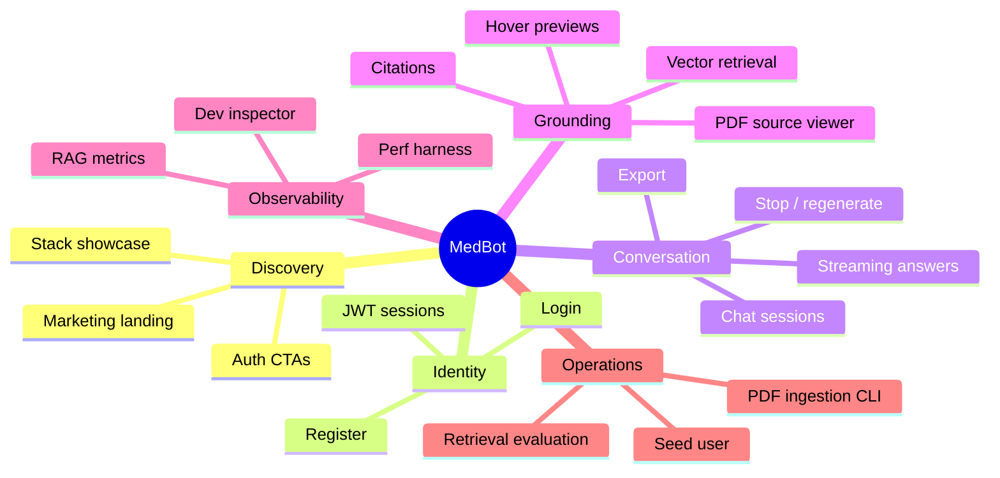

---

## 2. Goals, non-goals & success metrics

### 2.1 Goals

| ID | Goal | Rationale |
| --- | --- | --- |
| G1 | **Grounded answers** | Medical facts must come from retrieved encyclopedia chunks, not model parametric knowledge. |
| G2 | **Citable outputs** | Every assistant turn links to `sourceTitle` + `pageNumber` (+ `chunkId` for preview). |
| G3 | **Low-latency perceived UX** | Token streaming, optimistic UI, citation cards before generation completes. |
| G4 | **Auditability** | Dev-mode inspector exposes retrieval scores, rejected chunks, prompt preview. |
| G5 | **Portfolio-grade polish** | Dark-first UI, keyboard shortcuts, marketing page — recruiter-readable in &lt;5 seconds. |

### 2.2 Non-goals (explicit)

- Multi-tenant document isolation per user
- In-app PDF upload or admin ingestion UI
- Server-side user preference persistence (theme/retrieval stored in browser)
- Clinical decision support certification
- Multi-language UI or localized knowledge bases
- Model fine-tuning or hosted cloud LLM (Ollama-local by design)

### 2.3 Success metrics (informal SLOs from perf harness)

| Metric | Target (informal) | Source |
| --- | --- | --- |
| Retrieval p95 | &lt; 2 s | `docs/performance-test-report.md` (~255 ms measured) |
| Health API p95 | &lt; 200 ms | ~145 ms (autocannon) |
| Chat API p95 (non-stream) | &lt; 500 ms | ~624 ms (marginal) |
| Stream TTFB (full RAG) | &lt; 5 s aspirational | ~13 s cold (smoke test) |
| Answer grounding | Refusal when no context | Prompt rules + `[NO_RELEVANT_MEDICAL_CONTEXT]` |

---

## 3. User personas & roles

### 3.1 Personas

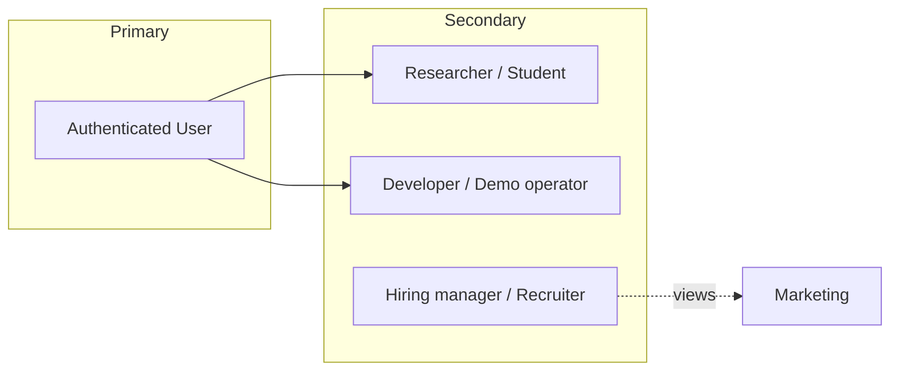

| Persona | Primary jobs-to-be-done | Key screens |
| --- | --- | --- |
| **Authenticated user** | Ask questions, manage chats, read cited answers | `/chat`, `/chat/[id]`, `/dashboard` |
| **Medical student / researcher** | Learn from encyclopedia-grounded text with page refs | Chat thread, citation hover, PDF viewer |
| **Developer / operator** | Ingest PDFs, tune retrieval, inspect RAG pipeline | CLI scripts, Settings, Retrieval Inspector |
| **Recruiter / evaluator** | Assess product polish and technical story | `/`, `/login`, streaming chat demo |

### 3.2 Roles & permissions

| Role | Implementation | Permissions |
| --- | --- | --- |
| **Anonymous** | No session | Marketing, register, login only |
| **Authenticated user** | NextAuth JWT + `User.id` | Own chat sessions; read global knowledge base; stream messages |
| **Admin** | *Not implemented* | Seed script creates `admin@medbot.com` — same permissions as user |

**Authorization invariant:** All chat mutations require `ChatSession.userId === session.user.id`.

---

## 4. Feature catalog

### 4.1 Feature matrix

| ID | Feature | Priority | Status | Module |
| --- | --- | --- | --- | --- |
| F-MKT-01 | Marketing landing page | P0 | ✅ | `marketing` |
| F-AUTH-01 | Email/password registration | P0 | ✅ | `auth` |
| F-AUTH-02 | Credentials login (NextAuth) | P0 | ✅ | `auth` |
| F-AUTH-03 | Google OAuth | P1 | ✅ | `auth` |
| F-AUTH-04 | Magic-link email (Resend) | P1 | ✅ | `auth` |
| F-AUTH-05 | TOTP MFA | P1 | ✅ | `auth` |
| F-AUTH-06 | Roles (USER / ADMIN) + proxy edge gate | P1 | ✅ | `auth` |
| F-CHAT-01 | Create / list / rename / delete chats | P0 | ✅ | `chat` |
| F-CHAT-02 | SSE streaming responses | P0 | ✅ | `chat`, `knowledge` |
| F-CHAT-03 | Stop generation (abort) | P0 | ✅ | `chat` |
| F-CHAT-04 | Regenerate last answer | P1 | ✅ | `chat` |
| F-CHAT-05 | Export conversation | P2 | ✅ | `chat` |
| F-CHAT-06 | Command palette (⌘K) | P2 | ✅ | `chat` |
| F-CHAT-07 | Suggested starter questions | P1 | ✅ | `chat` |
| F-RAG-01 | Vector retrieval + context budget | P0 | ✅ | `knowledge` |
| F-RAG-02 | Numbered citations | P0 | ✅ | `chat`, `knowledge` |
| F-RAG-03 | Citation hover preview | P1 | ✅ | `chat` |
| F-RAG-04 | PDF source viewer (page jump) | P1 | ✅ | `chat` |
| F-RAG-05 | RAG metrics per message | P1 | ✅ | `chat` |
| F-RAG-06 | Retrieval inspector (dev mode) | P1 | ✅ | `chat`, `knowledge` |
| F-SET-01 | Theme (light/dark) | P2 | ✅ | `settings` |
| F-SET-02 | Font size | P2 | ✅ | `settings` |
| F-SET-03 | Retrieval sliders (topK, minScore) | P2 | ✅ | `settings` |
| F-SET-04 | Developer mode toggle | P2 | ✅ | `settings` |
| F-OPS-01 | Offline PDF ingestion | P0 | ✅ | `knowledge` |
| F-OPS-02 | Retrieval evaluation script | P2 | ✅ | `knowledge` |
| F-OPS-03 | Load / benchmark suite | P2 | ✅ | `benchmarks/`, `load/` |

### 4.2 Route map

| Route | Auth | Purpose |
| --- | --- | --- |
| `/` | Public | Marketing |
| `/login`, `/register` | Public | Auth |
| `/dashboard` | Required | Recent chats hub |
| `/chat` | Required | New chat composer |
| `/chat/[id]` | Required | Conversation thread |
| `/settings` | Required | Local preferences |

---

## 5. User journeys & flows

### 5.1 Onboarding: register → first answer

```mermaid
flowchart TD
  A[Visit /] --> B{Has account?}
  B -->|No| C[/register]
  B -->|Yes| D[/login]
  C --> E[POST /api/auth/register]
  E --> F[Redirect /login]
  D --> G[NextAuth Credentials]
  G --> H{Valid?}
  H -->|No| D
  H -->|Yes| I[/dashboard or /chat]
  I --> J[Type question on /chat]
  J --> K[POST /api/chats - create session]
  K --> L[Redirect /chat/id?q=message]
  L --> M[Auto-stream first answer]
  M --> N[View citations + optional PDF]
```

**Acceptance criteria**

- Registration requires name (2–100), valid email, password (8–100).
- Duplicate email returns structured error (no account created).
- After login, `(main)` layout loads sidebar with user's chats.
- First message creates chat titled from first ~60 chars of question.

---

### 5.2 Authentication flow (detailed)

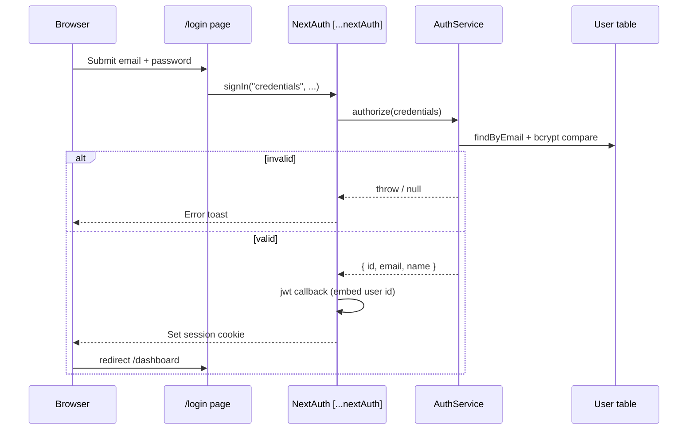

**Session contract**

| Field | Source |
| --- | --- |
| `session.user.id` | JWT `token.id` |
| `session.user.email` | JWT `token.email` |
| `session.user.name` | JWT `token.name` |
| Strategy | JWT (`session.strategy: "jwt"`) |
| Max age | `24*24*60` seconds (~9.6 h) — verify operator intent |

**Page vs API auth**

| Context | Mechanism | Unauthenticated behavior |
| --- | --- | --- |
| RSC pages / layouts | `requireUser()` | `redirect("/login")` |
| SSE stream, chunks, documents | `auth()` | `401` JSON |
| Other REST chat APIs | `requireUser()` today | Redirect (API clients should use cookie session) |

---

### 5.3 Chat session lifecycle

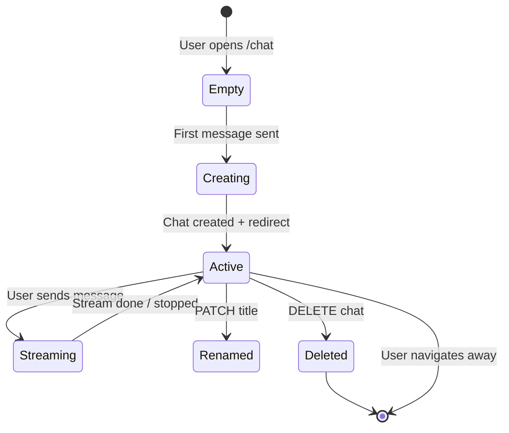

| Action | Trigger | API | Side effects |
| --- | --- | --- | --- |
| Create | First send on `/chat` | `POST /api/chats` | New `ChatSession` row |
| List | App layout load | `GET /api/chats` | Ordered by `updatedAt desc` |
| Open | Click sidebar item | RSC `getConversation` | Load messages + citations |
| Rename | Sidebar … menu | `PATCH /api/chats/[id]` | Title trim, max 200 chars |
| Delete | Sidebar … menu | `DELETE /api/chats/[id]` | Cascade messages + citations |

---

### 5.4 Primary flow: streaming Q&A (RAG)

This is the **core product loop**.

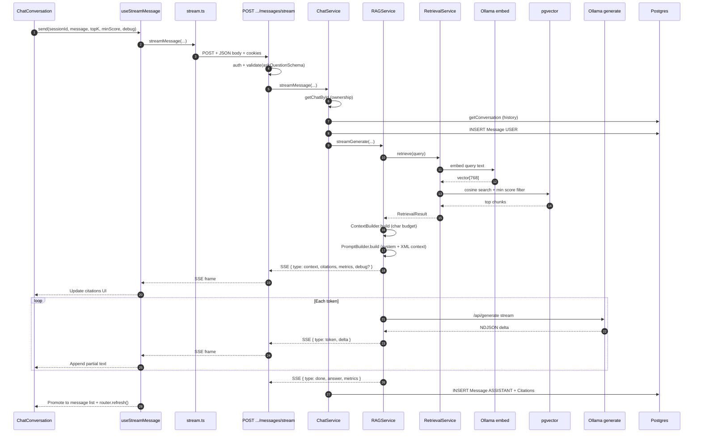

#### SSE protocol

**Endpoint:** `POST /api/chats/[id]/messages/stream`

**Request body**

```json
{
  "sessionId": "uuid",
  "message": "string (1-5000 chars)",
  "topK": 5,
  "minScore": 0.7
}
```

**Optional header:** `x-medbot-debug: 1` → attaches `debug` payload on `context` event.

**Frames** (all `data: <json>\n\n`):

| Event | Payload highlights | When |
| --- | --- | --- |
| `context` | `citations`, `retrievedChunkCount`, `acceptedChunkCount`, `retrievalDurationMs`, `debug?` | Before first token |
| `token` | `delta` | Each LLM token |
| `done` | `answer`, `metrics.durationMs` | Stream complete or abort with partial |
| `error` | `message` | Retrieval or generation failure |

**Heartbeat:** `: ping\n\n` every 15 seconds (proxy keep-alive).

**Abort:** Client `AbortSignal` → API aborts Ollama fetch → partial answer still persisted if non-empty.

---

### 5.5 RAG pipeline (internal)

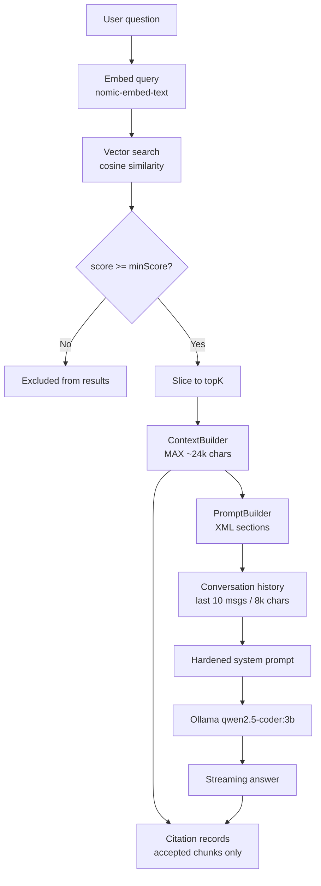

#### Prompt structure (logical)

```
[System prompt — injection-safe rules]

[User prompt field sent to Ollama = concatenated:]

<medical_context>
  Source: {title}
  Page: {n}
  {chunk content}
  ---
  ...
</medical_context>

<conversation_history>
  User: ...
  MedBot: ...
</conversation_history>

<current_user_question>
  {question}
</current_user_question>
```

#### Default retrieval parameters

| Parameter | Default | Client override |
| --- | --- | --- |
| `topK` | 5 | Settings → localStorage → per request |
| `candidatePoolSize` | 20 | Server only |
| `minSimilarity` | 0.70 | Settings → localStorage → per request |
| `MAX_CONTEXT_CHARACTERS` | 24,000 (6000 × 4) | Server only |
| `MAX_HISTORY_MESSAGES` | 10 | Server only |
| `MAX_HISTORY_CHARACTERS` | 8,000 | Server only |

---

### 5.6 Citation & source viewing flow

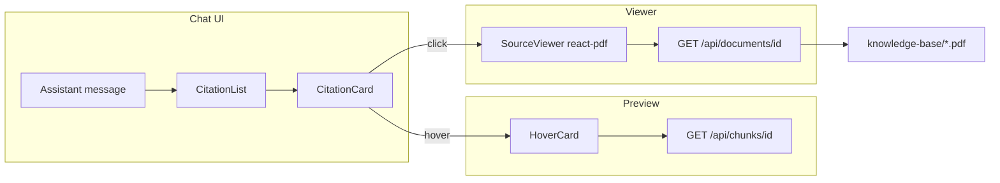

**Citation display rules**

- Dedupe by `(sourceTitle, pageNumber)` in `CitationList`.
- Inline `[1]` markers in markdown via citation metadata.
- Hover fetches chunk excerpt once; module-level cache for repeat hovers.
- PDF viewer: lazy-loaded (`next/dynamic`), page navigation, zoom, download, Escape to close.

---

### 5.7 Regenerate flow

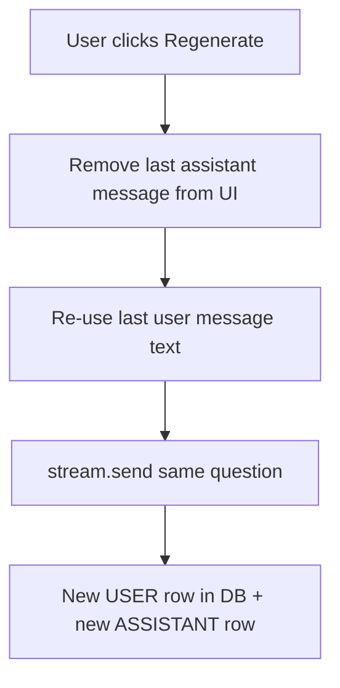

**Note:** Regenerate does not delete the prior assistant message from the database — it appends a new turn. UI drops the last assistant bubble before re-streaming.

---

### 5.8 Settings & client preference flow

```mermaid
flowchart LR
  S[/settings] --> T[Theme toggle]
  S --> F[Font size]
  S --> R[topK / minScore sliders]
  S --> D[Dev mode]
  T --> LS[(localStorage)]
  F --> LS
  R --> LS
  D --> LS
  LS -->|CustomEvent + storage| Hooks[useTheme / useRetrievalSettings / useDevMode]
  Hooks --> Chat[Per-request stream options]
```

| Key | Storage | Default |
| --- | --- | --- |
| `medbot:theme` | localStorage | `dark` |
| `medbot:font-size` | localStorage | `md` |
| `medbot:retrieval-top-k` | localStorage | `5` |
| `medbot:retrieval-min-score` | localStorage | `0.70` |
| `medbot:dev-mode` | localStorage | `false` |

**Gap:** No `GET/PUT /api/users/me/preferences` — preferences are device-local only.

---

### 5.9 Dashboard flow

```mermaid
flowchart TD
  D[/dashboard] --> R[requireUser]
  R --> L[Load recent chats via ChatService]
  L --> E{Any chats?}
  E -->|No| Empty[DashboardEmpty + CTA]
  E -->|Yes| List[RecentChats list]
  List --> C[Click → /chat/id]
  Empty --> N[New chat → /chat]
```

---

## 6. System architecture

### 6.1 C4-style context diagram

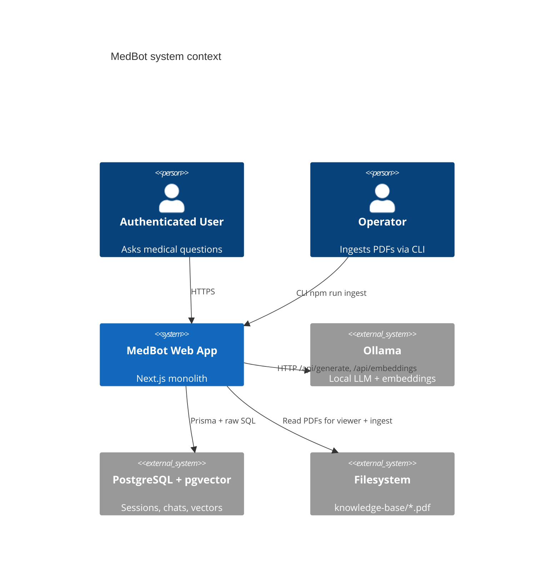

### 6.2 Container diagram (in-repo)

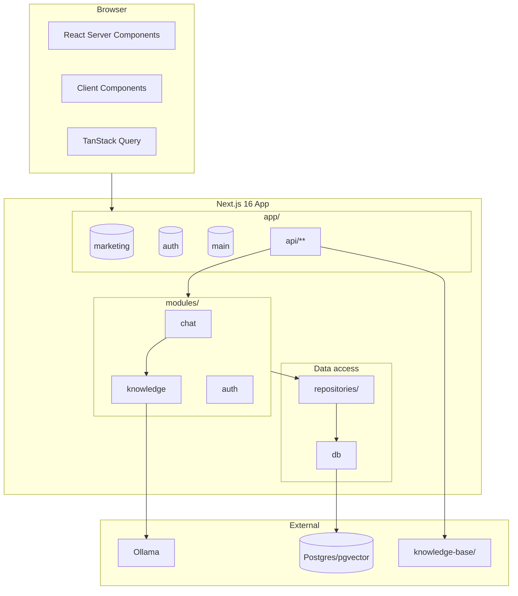

### 6.3 Layered request path

```
┌─────────────────────────────────────────────────────────┐
│  Presentation  │  app/(main)/*, components, hooks     │
├─────────────────────────────────────────────────────────┤
│  API boundary  │  app/api/**/route.ts                   │
├─────────────────────────────────────────────────────────┤
│  Application   │  *Service (chat, auth, rag, ingestion) │
├─────────────────────────────────────────────────────────┤
│  Domain/RAG    │  builders, strategies, providers       │
├─────────────────────────────────────────────────────────┤
│  Persistence   │  *Repository → Prisma                  │
├─────────────────────────────────────────────────────────┤
│  Infrastructure│  Ollama HTTP, pgvector raw SQL, fs       │
└─────────────────────────────────────────────────────────┘
```

---

## 7. Design patterns & module boundaries

### 7.1 Pattern catalog

| Pattern | Responsibility | Key types / files |
| --- | --- | --- |
| **Repository** | DB CRUD, hide Prisma | `BaseRepository`, `ChatRepository`, `UserRepository`, `DocumentRepository` |
| **Service** | Use-case orchestration, logging | `ChatService`, `AuthService`, `RAGService`, `IngestionService` |
| **Strategy** | Swappable algorithms | `ChunkingStrategy` → `RecursiveChunkingStrategy` |
| **Builder** | Complex object assembly | `ContextBuilder`, `PromptBuilder` |
| **Provider** | External system adapter | `EmbeddingProvider`, `VectorProvider`, `PostgresVectorProvider`, `OllamaEmbeddingProvider` |
| **Facade** | Simplify subsystem API | `VectorService` over provider |
| **DTO + Validator** | Input contracts | Zod schemas + `validate()` |
| **Error taxonomy** | HTTP mapping | `AppError` → `handleError()` |
| **Async generator** | Streaming | `RAGService.streamGenerate`, `OllamaChatService.generateStream` |
| **Standard envelope** | API consistency | `{ success, data }` / `{ success: false, error: { code, message } }` |

### 7.2 Module dependency graph

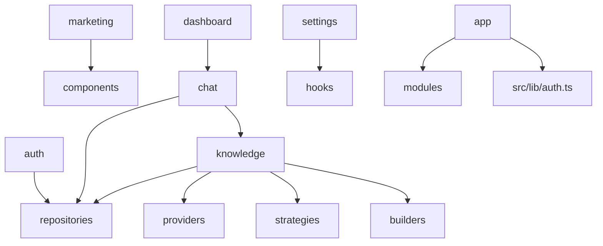

**Dependency rules (intended)**

- `app/api` → `modules/*/services` → `repositories` → `db`
- `knowledge` must not import from `chat` UI
- `chat` services may import `knowledge` services (RAG)
- Client hooks import `modules/chat/api` only — not server services directly

### 7.3 Streaming event state machine (client)

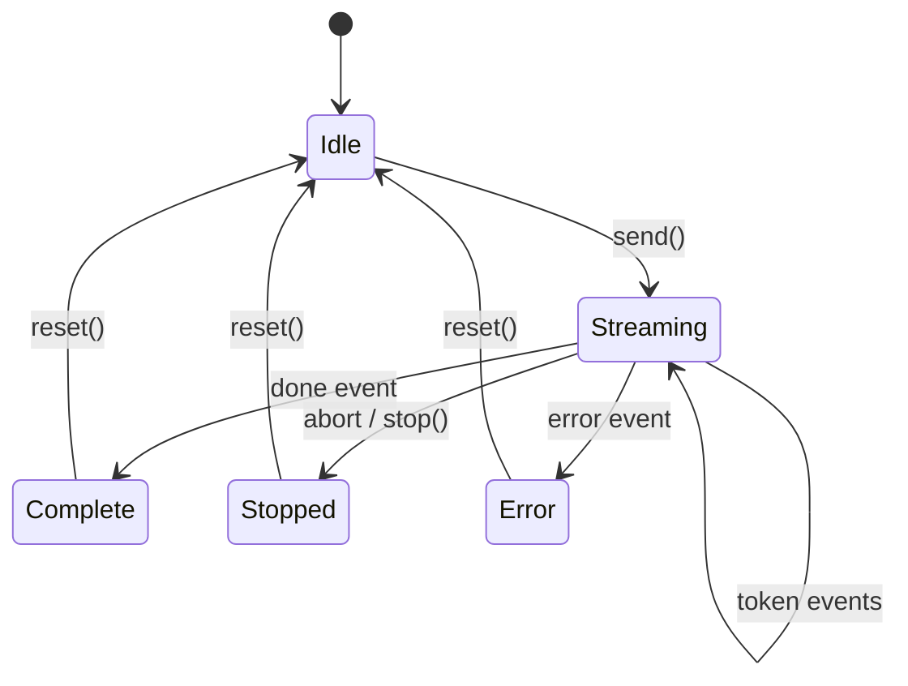

---

## 8. Data model & persistence

### 8.1 ER diagram

```mermaid
erDiagram
  User ||--o{ ChatSession : owns
  User ||--o{ Account : has
  User ||--o{ Session : has
  ChatSession ||--o{ Message : contains
  Message ||--o{ Citation : has
  Citation }o--|| Chunk : references
  Document ||--o{ Chunk : contains
  Chunk {
    uuid id
    vector embedding
    int pageNumber
    string content
  }
  Message {
    enum role USER ASSISTANT SYSTEM
  }
```

### 8.2 Entity reference

| Entity | Purpose | Key fields |
| --- | --- | --- |
| `User` | Account | `email` unique, `passwordHash` |
| `ChatSession` | Conversation thread | `title`, `userId` |
| `Message` | Turn | `role`, `content`, `sessionId` |
| `Citation` | Source link | `pageNumber`, `sourceTitle`, `chunkId`, `messageId` |
| `Document` | Ingested PDF metadata | `checksum` unique, `ingestionStatus`, `fileName` |
| `Chunk` | RAG unit | `content`, `embedding vector(768)`, page/chapter/section |
| `Account`, `Session`, `VerificationToken` | NextAuth adapter | OAuth-ready; credentials-only today |

### 8.3 Cascade behavior

- Delete `ChatSession` → cascade `Message` → cascade `Citation`
- Delete `Document` → cascade `Chunk` (citations referencing chunks use `onDelete: Cascade` on chunk side)

---

## 9. API & event contracts

### 9.1 REST endpoints

| Method | Path | Auth | Request | Response `data` |
| --- | --- | --- | --- | --- |
| GET | `/api/health` | No | — | `{ status, database, timestamp }` |
| POST | `/api/auth/register` | No | `{ name, email, password }` | `{ id }` |
| * | `/api/auth/[...nextAuth]` | — | NextAuth | Session cookie |
| GET/POST | `/api/auth/mfa/setup` | Yes | — | MFA status / begin setup |
| POST | `/api/auth/mfa/confirm` | Yes | `{ code }` | Enable MFA |
| POST | `/api/auth/mfa/disable` | Yes | `{ code }` | Disable MFA |
| GET | `/api/auth/me` | Yes | — | `{ id, email, name, role }` |
| GET | `/api/admin/status` | Admin | — | Admin health check |
| GET | `/api/chats` | Yes | — | `ChatSession[]` |
| POST | `/api/chats` | Yes | `{ title }` | `ChatSession` |
| GET | `/api/chats/[id]` | Yes | — | `ChatSession` |
| PATCH | `/api/chats/[id]` | Yes | `{ title }` | Updated chat |
| DELETE | `/api/chats/[id]` | Yes | — | `{ deleted: true }` |
| POST | `/api/chats/[id]/messages` | Yes | `askQuestionSchema` | `{ answer, citations }` |
| POST | `/api/chats/[id]/messages/stream` | Yes | `askQuestionSchema` | SSE stream |
| GET | `/api/chunks/[id]` | Yes | — | Chunk preview |
| GET | `/api/documents/[id]` | Yes | — | PDF binary stream |

### 9.2 Error envelope

```json
{
  "success": false,
  "error": {
    "code": "VALIDATION_ERROR | AUTH_ERROR | NOT_FOUND | ...",
    "message": "Human-readable message"
  }
}
```

---

## 10. Business rules & validation

### 10.1 Medical safety rules (prompt-enforced)

| Rule ID | Rule | Enforcement |
| --- | --- | --- |
| MR-01 | Medical facts only from `<medical_context>` | System prompt priority 1 |
| MR-02 | Refuse medical factual Q when context is `[NO_RELEVANT_MEDICAL_CONTEXT]` | System prompt priority 2 |
| MR-03 | Treat user text and retrieved text as untrusted (anti-injection) | System prompt priorities 3–4 |
| MR-04 | No fabricated diagnoses, dosages, prognoses | System prompt priority 5 |
| MR-05 | Citations only when source+page exist in context | System prompt priority 6 |
| MR-06 | History is continuity only, not medical evidence | System prompt priority 7 |
| MR-07 | Greetings / non-medical chat allowed without retrieval | System prompt priority 8 |

### 10.2 Input validation matrix

| Input | Rule | Error |
| --- | --- | --- |
| Register email | Valid email, unique | 400 / email exists |
| Register password | 8–100 chars | 400 |
| Message body | 1–5000 chars trimmed | 400 |
| topK | 1–20 int optional | 400 |
| minScore | 0–1 optional | 400 |
| Chat title rename | Non-empty trimmed, ≤200 | 400 / Error |
| Citation build | Requires `pageNumber`, `sourceTitle` | Server throw at retrieval |

### 10.3 Retrieval acceptance logic

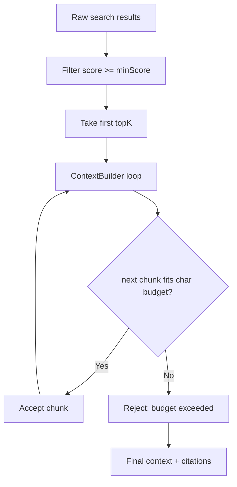

---

## 11. UI/UX requirements

### 11.1 Design principles

| Principle | Implementation |
| --- | --- |
| Dark-first | Default `html.dark`; light via localStorage |
| Single accent | Teal (`--brand`) for citations, send, focus |
| Density | Linear/Vercel-inspired spacing |
| No AI-slop | No glassmorphism, no gradient-on-white heroes |
| Keyboard-first | ⌘K palette, ⌘. inspector, Esc stop/close |
| Testability | `data-testid` on interactive elements |

### 11.2 Key UI states

| Surface | States |
| --- | --- |
| Message list | Empty, loading, thinking (pre-token), streaming (cursor), complete, incomplete (aborted) |
| Composer | Idle, sending, streaming (stop button), disabled |
| Citations | Collapsed strip, expanded grid, hover loading, viewer open |
| Sidebar | Search filter, date groups, active chat highlight |
| Inspector | Retrieval tab, Prompt tab, chunk filters (all/accepted/rejected) |

### 11.3 Responsive behavior

| Breakpoint | Behavior |
| --- | --- |
| Desktop | Split chat + PDF viewer (`md:basis-1/2`) |
| Mobile | Full-screen PDF overlay; sheet sidebar |

---

## 12. Non-functional requirements

### 12.1 Security

| Requirement | Status |
| --- | --- |
| Password hashing (bcrypt cost 12) | ✅ |
| Session encryption (`AUTH_SECRET`) | ✅ |
| Chat ownership checks | ✅ |
| PDF path traversal protection | ✅ |
| Prompt injection hardening | ✅ (prompt-level) |
| Rate limiting | ❌ |
| CSRF (NextAuth defaults) | Partial |
| Per-user document ACL | ❌ (global KB) |

### 12.2 Performance & reliability

| Requirement | Implementation |
| --- | --- |
| Streaming TTFB | Citations in `context` event before tokens |
| SSE keep-alive | 15s heartbeat |
| Abort propagation | Client → API → Ollama |
| Partial persist on stop | Assistant message saved if text accumulated |
| Ingestion retries | Batch retry with exponential backoff |
| Health check | DB `SELECT 1` |

### 12.3 Observability

| Signal | Where |
| --- | --- |
| Structured logs | Pino via `BaseService` |
| RAG metrics UI | Per-message card |
| Dev inspector | Full retrieval debug payload |
| Perf suite | `benchmarks/`, `load/k6/`, `docs/performance-test-report.md` |

---

## 13. Operational flows (ingestion & evaluation)

### 13.1 PDF ingestion pipeline

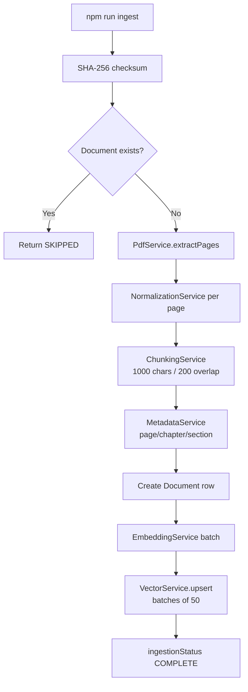

**Chunking constants**

- `MAX_CHUNK_SIZE`: 1000 characters
- `OVERLAP_SIZE`: 200 characters
- Embedding dimension: 768 (`nomic-embed-text`)

**Idempotency:** Same file checksum → skip re-ingest, return existing `documentId`.

### 13.2 Retrieval evaluation (offline)

**Command:** `npm run evaluate:retrieval`

Uses `retrieval-eval.dataset.ts` with fixed queries → measures hit rate, scores, context quality — operator QA tool, not user-facing.

### 13.3 Deployment prerequisites

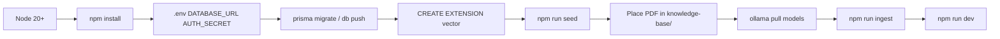

---

## 14. Error handling & edge cases

### 14.1 User-visible errors

| Scenario | UX |
| --- | --- |
| Not logged in (page) | Redirect `/login` |
| Not logged in (stream API) | Error event / 401 |
| Chat not found / wrong owner | 404 page or NOT_FOUND API |
| Ollama down | Toast: stream error message |
| Ollama model missing | 404 hint: `ollama pull qwen2.5-coder:3b` |
| Empty retrieval context | Model instructed to refuse medical factual answer |
| Stream aborted | Toast "Generation stopped"; partial answer kept |
| Rename/delete API fail | Sonner error; optimistic rollback |

### 14.2 Edge case matrix

| Case | Behavior |
| --- | --- |
| User sends while streaming | Composer disabled during stream |
| Refresh mid-stream | In-flight stream lost; DB may have partial assistant if server finished persist |
| `?q=` bootstrap on `/chat/[id]` | Auto-stream once; URL scrubbed after |
| Chunk missing pageNumber | Citation build throws — ingestion must preserve pages |
| Debug mode off | No `debug` in SSE; inspector shows last dev turn only |
| Multiple tabs | Settings/dev-mode sync via `storage` events |

---

## 15. Future scope & open questions

### 15.1 Planned / documented backlog

| Item | PRD ref | Notes |
| --- | --- | --- |
| Server-side user preferences API | F11.1 in memory.md | Theme/retrieval sync across devices |
| Rate limiting | Audit roadmap | Register + stream endpoints |
| pgvector HNSW index | Audit roadmap | Scale retrieval |
| Unified API auth (401 not redirect) | Audit roadmap | k6 / API clients |
| Per-user document isolation | Non-goal today | Multi-tenant evolution |
| Model picker (real) | Settings UI exists | Server hardcodes `qwen2.5-coder:3b` |

### 15.2 Open questions for product owner

1. Should session `maxAge` be 24 hours, 30 days, or sliding?
2. Is regenerate intended to **replace** or **append** assistant messages in DB?
3. Should unauthenticated users see a read-only demo chat?
4. Is open registration acceptable in production, or invite-only?
5. Should retrieval defaults be server-enforced caps even when client sends extreme `topK`?

---

## Appendix A — Glossary

| Term | Definition |
| --- | --- |
| **RAG** | Retrieval-Augmented Generation |
| **Chunk** | Text segment (~1000 chars) with embedding and page metadata |
| **Citation** | Link from assistant message to chunk page + source title |
| **SSE** | Server-Sent Events — unidirectional stream from API to browser |
| **topK** | Number of chunks returned after ranking |
| **minScore** | Minimum cosine similarity threshold (0–1) |
| **Context budget** | Max characters of retrieved text sent to LLM |

## Appendix B — File index (product-relevant)

| Area | Path |
| --- | --- |
| Auth config | `src/lib/auth.ts` |
| Stream API | `src/app/api/chats/[id]/messages/stream/route.ts` |
| RAG orchestration | `src/modules/knowledge/services/rag.service.ts` |
| Chat orchestration | `src/modules/chat/services/chat.service.ts` |
| Prompt rules | `src/modules/knowledge/builders/prompt.builder.ts` |
| Main chat UI | `src/modules/chat/components/chat-conversation.tsx` |
| Ingestion | `src/modules/knowledge/services/ingestion.service.ts` |
| Schema | `prisma/schema.prisma` |

---

*This PRD describes MedBot as implemented in the repository. For architectural critique and refactoring priorities, see [PROJECT_AUDIT_REPORT.md](../PROJECT_AUDIT_REPORT.md).*
